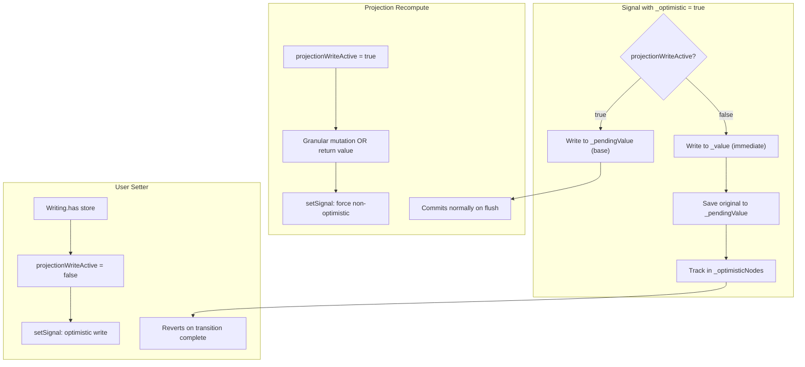

# createOptimisticStore Implementation

## Overview

`createOptimisticStore` combines two existing primitives:

- **createOptimistic**: Signals that show updates immediately but revert when transitions complete
- **createStore**: Proxy-based reactive stores with fine-grained tracking

The result should allow optimistic UI patterns with complex nested data structures.

## Architecture

All optimistic stores are implemented as **projections** (even "static" ones).

**Key principles:**

- Signals are lazy - only created for observed paths
- Unobserved paths don't need multiple realities
- `STORE_VALUE` is immutable (never mutated, only replaced by reconcile)

**Two write contexts, two override layers:**

1. **Projection writes** (`projectionWriteActive = true`) → `STORE_OVERRIDE` (permanent base updates)
2. **User setter writes** (`projectionWriteActive = false`) → `STORE_OPTIMISTIC_OVERRIDE` (reverted on transition complete)

**Read priority:** `STORE_OPTIMISTIC_OVERRIDE` → `STORE_OVERRIDE` → `STORE_VALUE`

**On reversion:** Clear `STORE_OPTIMISTIC_OVERRIDE` entirely, notify existing signals



## Key Implementation Points

### 1. STORE_OPTIMISTIC_OVERRIDE Layer

Add a new store property `STORE_OPTIMISTIC_OVERRIDE` that holds optimistic writes:

- User setter writes → `STORE_OPTIMISTIC_OVERRIDE`
- Projection/reconcile writes → `STORE_OVERRIDE` (unchanged)
- Reads check: `STORE_OPTIMISTIC_OVERRIDE` → `STORE_OVERRIDE` → `STORE_VALUE`

### 2. Minimal Changes to storeTraps

Add small branches to existing traps (minimal code size impact):

**get trap:** Check optimistic override first, ~8-10 lines of new code

**set trap:** Choose target based on `projectionWriteActive` flag

**delete trap:** Same pattern as set

**has/ownKeys:** Check optimistic override in lookup chain

For non-optimistic stores: one undefined check per access (minimal overhead).

### 3. projectionWriteActive Flag (already done)

In scheduler.ts - distinguishes projection writes from user setter writes.

- `projectionWriteActive = true` → write to `STORE_OVERRIDE`
- `projectionWriteActive = false` → write to `STORE_OPTIMISTIC_OVERRIDE` (for optimistic stores)

### 4. Signal-level Tracking for Observed Paths

Signals marked with `_optimistic = true` for reactive notifications.

When `STORE_OPTIMISTIC_OVERRIDE` is cleared, notify existing signals to trigger re-reads.

### 5. Reversion Mechanism

Track optimistic stores that have been modified. On transition complete:

1. Clear `STORE_OPTIMISTIC_OVERRIDE` for tracked stores
2. Notify any existing signals to re-read from base values

### 6. All Optimistic Stores are Projections

Static stores become projections internally for consistency.

## File Changes

### [src/core/scheduler.ts](src/core/scheduler.ts) ✅

- Add `projectionWriteActive` flag and setter
- Add `optimisticStores` to Transition interface and GlobalQueue
- Add `trackOptimisticStore` function
- Update `finalizePureQueue` to clear optimistic stores
- Create new Set when stashing incomplete transitions

### [src/core/core.ts](src/core/core.ts) ✅

- Import `projectionWriteActive` from scheduler
- Modify `setSignal` to check flag

### [src/store/projection.ts](src/store/projection.ts) ✅

- Call `setProjectionWriteActive(true/false)` in writeTraps

### [src/store/store.ts](src/store/store.ts) ✅

- Add `STORE_OPTIMISTIC_OVERRIDE` constant and type
- Modify `get` trap: check optimistic override first
- Modify `set` trap: write to optimistic override when appropriate
- Modify `delete` trap: same pattern
- Modify `has`, `ownKeys`, `getOwnPropertyDescriptor`: check optimistic override
- Add `clearOptimisticStore` function and register with scheduler

### [src/store/optimistic.ts](src/store/optimistic.ts) ✅

- Implement `createOptimisticStore` with optimistic projection
- Add `optimisticWriteTraps` for projection context
- Handle both static and derived modes

## API Signatures

```typescript
// Simple optimistic store - becomes a projection internally
createOptimisticStore<T>(store: T | Store<T>): [Store<T>, StoreSetter<T>]

// Derived optimistic store  
createOptimisticStore<T>(
  fn: (store: T) => void | T | Promise<...>,
  store?: T | Store<T>,
  options?: StoreOptions
): [Store<T>, StoreSetter<T>]
```

## Test Categories

### Basic Behavior

- Store and return value on read
- Update store via setter and revert on flush
- Multiple optimistic updates before flush
- Nested object updates and reversion

### Async Transitions

- Show optimistic value during async transition
- Revert when transition completes
- Multiple sequential cycles
- Rapid successive actions (independent optimistic stores)

### Derived Stores

- Derive from source and revert optimistic writes
- Hold source during async, revert optimistic when complete
- Granular mutations in projection vs return value reconcile

### Store-specific Features

- Array operations (push, pop, splice) with reversion
- Nested object property addition/deletion
- Object.keys tracking through optimistic changes
- `in` operator behavior with overrides